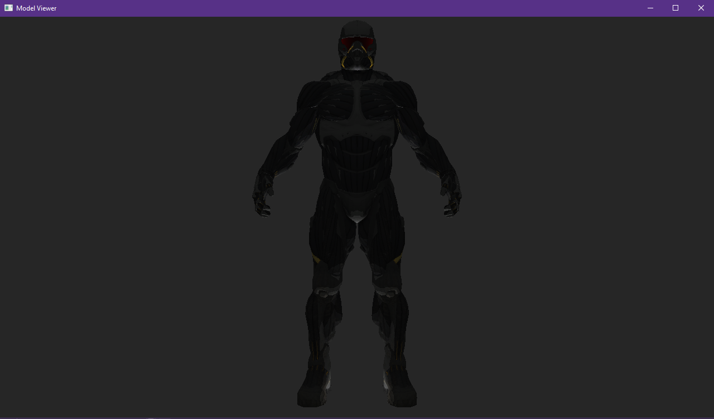
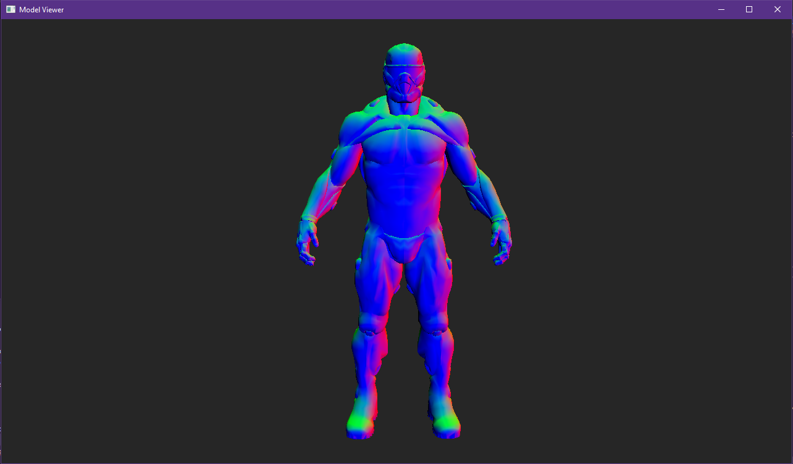

# Engine Framework
This is a small project which is the base for most/all other game related C++ projects. This currently has a renderer system with OpenGL and the starts of Vulkan implemented.

## Model Viewer
Currently this framework is being used for a small model viewer program. This programs goal is to render a selected model with different shader/lighting effects. 

### OpenGL status
Currently OpenGL has the ability to render 3d models with vertex and texture information.

### Vulkan Status
Currently Vulkan has the ability to render 3d models with vertex information.

Model: 